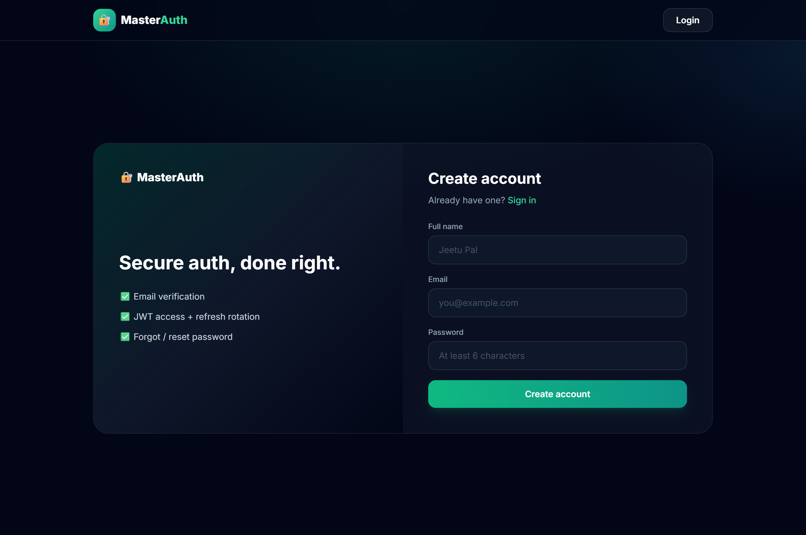
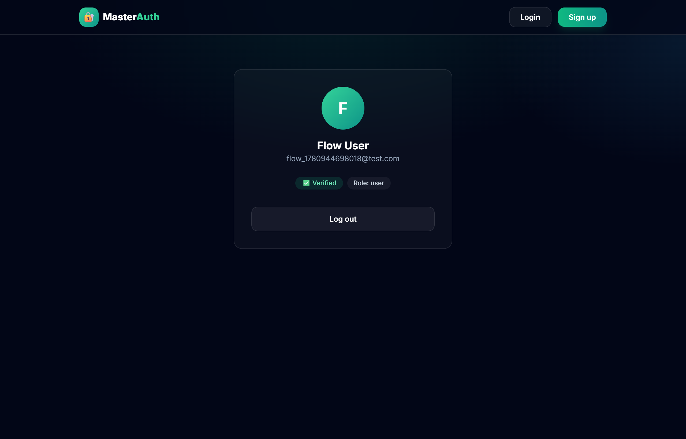

# 🔐 Master Authentication

> A production-ready Node.js authentication backend featuring JWT access/refresh token rotation, email verification, forgot/reset password, and cookie-based sessions.


---

## 📸 Screenshots (React frontend)

| Register | Profile |
|----------|---------|
|  |  |

A **Vite + React + Tailwind** frontend lives in [`/frontend`](frontend) — register,
email-verify notice, login, protected profile, and forgot/reset password, all wired
to this API.

```bash
cd frontend
npm install
cp .env.example .env   # point VITE_API_URL at the backend
npm run dev            # http://localhost:5173
```

---

## ✨ Features

- ✅ **Register** with email + password
- ✅ **Email verification** via tokenised link (expires in 10 min)
- ✅ **Login** — issues `accessToken` + `refreshToken` as HttpOnly cookies
- ✅ **Token rotation** — middleware auto-rotates both tokens on every authenticated request
- ✅ **Get profile** — protected route returns current user data
- ✅ **Logout** — clears cookies and invalidates refresh token in DB
- ✅ **Forgot password** — sends a reset link via email (expires in 15 min)
- ✅ **Reset password** — validates token and updates password securely

---

## 🔌 API Endpoints

| Method | Endpoint | Auth | Description |
|--------|----------|------|-------------|
| POST | `/api/v1/users/register` | Public | Register new user |
| GET | `/api/v1/users/verify/:token` | Public | Verify email address |
| POST | `/api/v1/users/login` | Public | Login and get tokens |
| GET | `/api/v1/users/get-profile` | 🔒 Required | Get current user profile |
| POST | `/api/v1/users/logout` | 🔒 Required | Logout and clear session |
| POST | `/api/v1/users/forgot-password` | Public | Request password reset email |
| POST | `/api/v1/users/reset-password/:token` | Public | Reset password with token |

---

## 🛡️ Auth Flow

```
Register → Email Verification → Login
                                  │
                          accessToken (15m) + refreshToken (7d)
                                  │
                        Middleware auto-rotates tokens
                        on every protected request
```

---

## 🗂️ Project Structure

```
master-authentication/
├── controllers/
│   └── use.controller.js      # All auth logic
├── middleware/
│   └── isloggedin.js          # JWT verification + token rotation
├── models/
│   └── user.models.js         # Mongoose user schema
├── routes/
│   └── user.routes.js         # Route definitions
├── utils/
│   ├── db.js                  # MongoDB connection
│   └── sendMail.utils.js      # Nodemailer email sender
├── index.js                   # Express app entry point
└── .env.example               # Environment variable template
```

---

## 🚀 Getting Started

### Prerequisites
- Node.js `v18+`
- MongoDB (local or Atlas)
- SMTP email credentials (Gmail app password recommended)

### Setup

```bash
git clone https://github.com/jeetupal31/master-authentication.git
cd master-authentication
npm install
cp .env.example .env
# Fill in your MongoDB URI, JWT secrets, and email credentials
npm run dev
```

Server starts at `http://localhost:3000`

---

## ⚙️ Environment Variables

```env
PORT=3000
MONGODB_URI=mongodb://localhost:27017/master-auth

ACCESSTOKEN_SECRET=your_access_token_secret
ACCESSTOKEN_EXPIRY=15m

REFRESHTOKEN_SECRET=your_refresh_token_secret
REFRESHTOKEN_EXPIRY=7d

EMAIL_HOST=smtp.gmail.com
EMAIL_PORT=587
EMAIL_SECURE=false
EMAIL_USER=your_email@gmail.com
EMAIL_PASS=your_app_password
SENDER_EMAIL=your_email@gmail.com

BASE_URL=http://localhost:3000
```

---

## 🛠️ Tech Stack

| Layer | Technology |
|-------|-----------|
| Runtime | Node.js (ESM) |
| Framework | Express.js |
| Database | MongoDB + Mongoose |
| Auth | JWT (access + refresh tokens) |
| Password | bcryptjs |
| Email | Nodemailer |
| Session | HttpOnly cookies |

---

## 👨‍💻 Author

**Jeetu Pal**
[](https://github.com/jeetupal31)

---

## 📄 License

MIT
